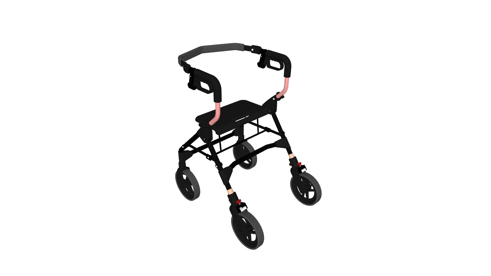
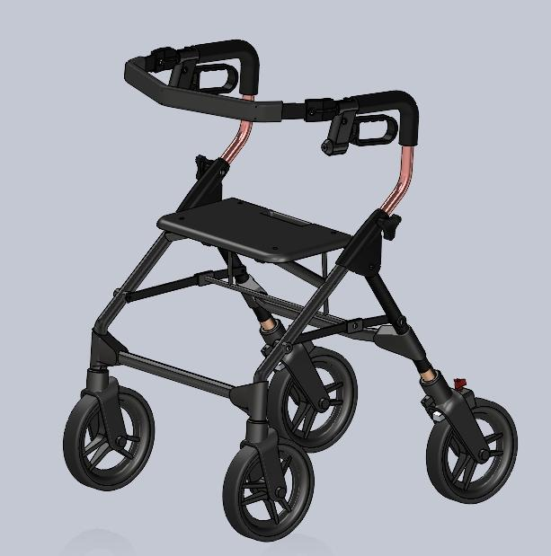

# (UNOFFICIAL) CAD/3D Model of a Commercially Available Walker/Rollator
 **Disclaimer: This walker model is an unofficial recreation of a commercially available walker/rollator. Thus, there may be inaccuracies in the model. It is only intended to be used for visual and educational purposes only.**

** **

This is a CAD/3D model of a commercially available walker, created for visual purposes as part of a project from an undergraduate engineering student team (BMERIT). The files are available in STEP and SLDPRT (SolidWorks Education) format, with an assembled file also available in STEP format and as an OBJ with an MTL file for colouring.

Additionally, a SLDASM (SolidWorks Education) file has been included with the walker assembly. If this assembly file is to be used, **you must either use the SLDPRT files or export the STEP files as SLDPRT files and replace the parts in the assembly**. The mates have been defined in the assembly so that the walker is capable of folding/unfolding.

This was possible due to the permission and help of Allah (SWT), as is the case with everything. Additional help came from Alberta Health Services, who allowed our team to borrow the walker for our project, and the support of BMERIT.

****

** **

Shield: [![CC BY-NC 4.0][cc-by-nc-shield]][cc-by-nc]

This work is licensed under a
[Creative Commons Attribution-NonCommercial 4.0 International License][cc-by-nc].

[![CC BY-NC 4.0][cc-by-nc-image]][cc-by-nc]

[cc-by-nc]: https://creativecommons.org/licenses/by-nc/4.0/
[cc-by-nc-image]: https://licensebuttons.net/l/by-nc/4.0/88x31.png
[cc-by-nc-shield]: https://img.shields.io/badge/License-CC%20BY--NC%204.0-lightgrey.svg
